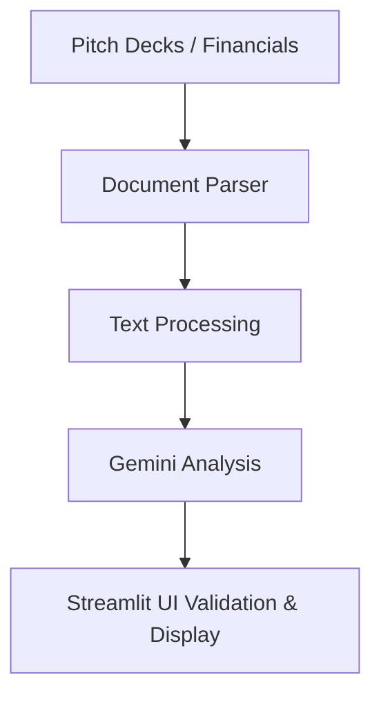

# Founder Submission Triage Agent

Founder Submission Triage Agent is a lightweight internal screening product for venture capital teams, angel networks, and accredited investor platforms. It helps investment teams move from inbox-driven founder intake to faster, more consistent first-pass analysis.

## Problem

Manual founder screening is slow and inconsistent.

Pitch decks arrive in different formats, financial data is scattered across attachments, and early diligence often depends on whoever happens to review the submission first. That creates uneven screening quality, slower turnaround times, and too much analyst time spent on repetitive intake work.

## Solution

AI-powered startup intake and investment analysis.

This MVP ingests founder materials, extracts high-signal evidence from multiple documents, sends a structured context bundle to Gemini, validates the response, and presents the result in a clean Streamlit interface designed for investor workflows.

## Features

- Multi-document ingestion
- PDF/PPTX support
- Gemini-powered analysis
- Investment readiness scoring
- Evidence-backed extraction
- JSON export

## Who It Is For

- Venture Capital teams running high-volume inbound founder review
- Angel networks triaging early-stage opportunities before partner discussion
- Accredited investor platforms standardizing intake and first-pass screening

## Product Workflow



## What The Product Delivers

- Founder submissions are grouped into a unified evidence bundle across pitch decks, financial statements, cap tables, and legal documents.
- Gemini produces a structured screening output with company overview, traction signals, strengths, concerns, red flags, and readiness scoring.
- Source attribution is preserved wherever the uploaded materials clearly support a field.
- Analysts can review the result quickly in the UI and export JSON for downstream workflows.


- `app/parser.py`
Extracts text from PDF and PPTX files, preserves source boundaries, and assembles the internal document bundle.

- `app/utils.py`
Normalizes text, removes repeated noise, prioritizes relevant content, and loads environment configuration.

- `app/extractor.py`
Sends the unified context to Gemini, enforces structured output, retries once on malformed output, and maps API errors clearly.

- `app/schemas.py`
Defines typed response models, evidence attribution, and readiness scoring.

- `frontend/app.py`
Provides the investor-facing Streamlit interface for upload, review, and export.

## Setup

1. Install dependencies:

```bash
pip install -r requirements.txt
```

2. Copy environment variables:

```bash
cp .env.example .env
```

3. Start the application:

```bash
streamlit run main.py
```

4. Open:

- Streamlit UI: `http://localhost:8501`

## Environment Variables

- `GEMINI_API_KEY`

## Analyst Experience

### Upload Screen

Placeholder: add a screenshot of the multi-document upload interface here.

### Analysis Screen

Placeholder: add a screenshot of the loading and active analysis experience here.

### Results Screen

Placeholder: add a screenshot of the company overview, readiness score, strengths, concerns, and red flags here.


## Demo Output

The demo output lives at [sample_output/output.json](/D:/Founder%20Submission%20Triage%20%20Agent/sample_output/output.json:1).

The backend currently returns `investment_readiness_score`; in product copy and UI this is presented as the readiness score.

## Reliability Notes

- Structured output is validated with Pydantic before being returned.
- Gemini output is retried once if the response is malformed or schema-invalid.
- Source attribution is only included when it can be grounded to the uploaded document bundle.
- Repeated footer/header noise is stripped before LLM submission to keep context focused.

## Investor Positioning

This project is best understood as an internal intake and triage layer, not a final investment decision system. It helps investment teams:

- standardize first-pass founder review
- surface missing diligence quickly
- prioritize stronger opportunities for deeper discussion
- export consistent structured outputs for internal workflows

## Future Improvements

1. OCR support
2. Multi-document diligence
3. Cap table analysis
4. Financial benchmarking
5. Compliance checks
6. Investor-deal matching
